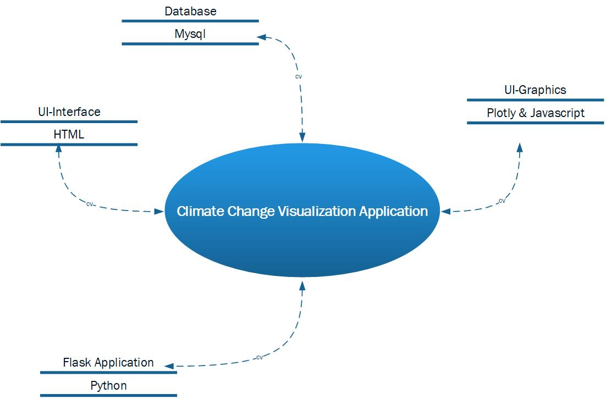

# Global-Warming

# Project Inspiration
Climate change is becoming one of the most alarming issue. Our inspiration started with a small discussion on how the weather has not been similar compared to past couple of years. This year we did not receive heavy snow and the winters were stretched out. There has been on going increase in the number of Tornadoes and cyclones, which bought lot of destructions to life and property in the prone areas.

To understand the climate and reason it is changing, its important to understand and analyze some key factors that could contribute to its change. The reason for ice melting in the north, to summers getting hotter and increase in the tornadoes and hurricane activities; our initial discussion and research led to below key factors:
•    Population
•    Pollution
•    Industrialization

# Data Sets used
CLimate Change in US States: https://www.kaggle.com/berkeleyearth/climate-change-earth-surface-temperature-data
Air Pollution Data :https://www.epa.gov/outdoor-air-quality-data
Population Data: https://www.kaggle.com/lodgeh/us-population-growth/data
Industrialization Emissions: https://www.eia.gov/opendata/qb.php?category=2251669

# Solution Architecture

# Pipeline to launch website
1)    Clone the repository to your local computer using the <repository name on GitHub>
2)    Open the terminal and go to the cloned directory and Activate Python data (conda activate PythonData)
3)    Run the code by using Python app.py command in terminal
4)    Use the URL and copy it to your internet browser
5)    Go around the website to explore and see the Visualizations
